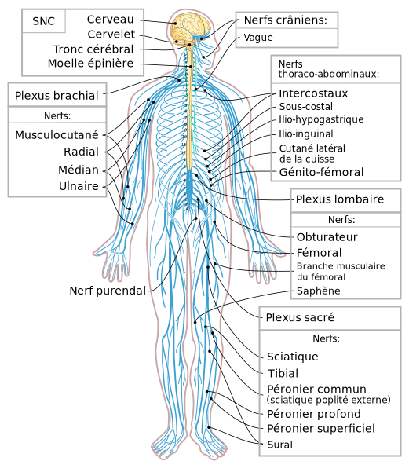

# L'importance fondamentale du système nerveux dans les activités humaines

# Rôle du système nerveux
Le système nerveux **contrôle** à un niveau fondamental nos expériences de tous les jours en tant qu'Humains.
Il influence ce que l'on ressent, notre état de stress, notre réaction face à une situation. Il joue donc un rôle important dans nos actions et notre état de tous les jours : Suis-je motivé ? fatigué ? ai-je envie d'entreprendre ? Et lorsque il est poussé dans les extrêmes, il peut générer des effets indésirables comme la dépression ou l'anxiété sévère. 

Comprendre comment fonctionne notre système nerveux, son influence sur notre état mais aussi comment nous pouvons l'influencer ouvre une porte vers l'optimisation de nos objectifs : 
* mieux apprendre
* améliorer nos performances sportives
* mieux gérer nos émotions
* améliorer un état de dépression ou d'anxiété
* améliorer notre sommeil
* améliorer notre sensibilité sociale 

# Le système nerveux, c'est quoi ? 
Le système nerveux est représenté sur la figure ci-dessous.

<!--  -->

Il est donc composé du cerveau, de la moelle épinière et des nerfs. Il est essentiel de comprendre que de nommbreuses connexions existent entre le sytème nerveux et les organses (le coeur, le foie, ...).

Le système nerveux influence les organes. Et inversément les organes influencent le système nerveux. **C'est essentiel de comprendre ce fait : chacun a une action réciproque sur l'autre**. Le corollaire est que le cerveau **n'est pas** un organe tout puissant qui régit notre corps. Comme nous le verrons, beaucoup de variables nous influencent sans que nous ayons une prise consciente sur ces derniers. La célèbre phrase *Mind over the body* est donc, en partie, une vaste blague. 

